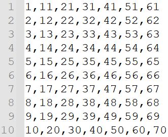
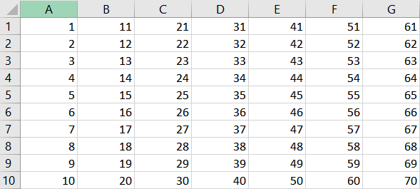
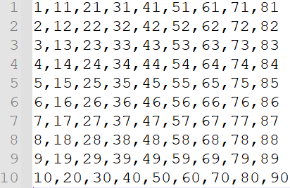

*************************
Dynamic Print Controls
*************************

.. contents:: Table of Contents

Print Script
=============
The print script is used to dynamically control print parameters on a layer by layer basis. The print script is a comma-separated values
(.csv) file that can be generated either with excel, text editors or with a custom script.

30 μm CLIP printer
---------------------------

The 30 μm printer can control the exposure time (ms), LED intensity, and dark time (ms) as dynamic variables. 
An example print script is included on the left side below with exposure time values ranging from 1-10, 
LED intensity values ranging from 11-20, dark time ranging from 21-30, layer thickness ranging from 31-40, stage velocity ranging from 41-50, stage acceleration ranging from 51-60, and pump height ranging from 61-70. The example print script was generated in
Excel and saved as a .csv file, the image below on the right side displays the example table in excel.

.. list-table:: Print Script Order and Units
   :widths: 12 12 12 12 12 12 12
   :header-rows: 1

   * - Exp Time
     - LED Int
     - Dark Time
     - Layer
     - Velocity
     - Acceleration
     - Pump Height
   * - ms
     - 1-255
     - ms
     - μm
     - mm/s
     - mm/s^2
     - μm

.. table:: 30 μm CLIP print script (exp time, LED intensity, dark time)
   :align: center

   +---------+---------+
   | |logo1| | |logo2| |
   +---------+---------+

Others printers
---------------------------
Other printers can control the exposure time (ms), LED intensity, dark time (ms), injection volume per layer
(μl), and injection rate (μl/s) as dynamic variables. 
An example print script is included on the left side below with exposure time values ranging from 1-10, 
LED intensity values ranging from 11-20, dark time ranging from 21-30, layer thickness ranging from 31-40, stage velocity ranging from 41-50, stage acceleration ranging from 51-60, pump height ranging from 61-70, injection volume ranging from 71-80, and injection rate ranging from 81-90. The example print script was generated in
Excel and saved as a .csv file, the image below on the right side displays the example table in excel.

.. list-table:: Print Script Order and Units
   :widths: 12 12 12 12 12 12 12 12 12
   :header-rows: 1

   * - Exp Time
     - LED Int
     - Dark Time
     - Layer
     - Velocity
     - Acceleration
     - Pump Height
     - Inj Vol
     - Inj Rate
   * - ms
     - 1-255
     - ms
     - μm
     - mm/s
     - mm/s^2
     - μm
     - μl
     - μl/s

.. |logo4| image:: images/PrintScriptExceliCLIP.PNG
    :scale: 60%

.. table:: Alternative print script (exp time, LED intensity, dark time, inj vol, inj rate)
   :align: center

   +---------+---------+
   | |logo3| | |logo4| |
   +---------+---------+

